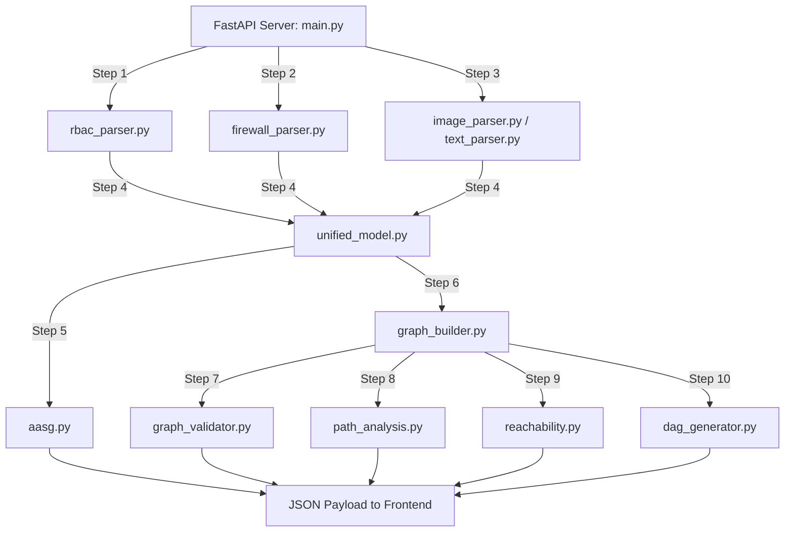

# 🛡️ Industrial Control Systems (ICS) AASG Threat Modeler
## System Presentation & Flow Guide (Version 2.1)

Welcome to the **ICS AASG Threat Modeler** documentation. This document explains how the project works, what its input/outputs are, what each module does, and the current development status in simple and clear language.

---

## 🎯 What is this Project?
Securing Industrial Control Systems (ICS/OT) requires keeping secure network boundaries (conduits) between different equipment zones (e.g., separating business workstations from physical PLCs and sensors, as defined by the **ISA/IEC 62443** standard). 

This project is a **visual threat modeling tool** that takes your network diagrams, firewall configs, and access rules, analyzes them, and automatically shows you:
1. An **interactive network map** organized by Purdue level.
2. **Security violations** (e.g., insecure connections bypassing firewalls).
3. **Attack vectors** (how an attacker could hop from the internet to control physical hardware).
4. **Compromise blast radius** (what else gets infected if a specific machine is compromised).

---

## 🚦 The Core Data Flow: Inputs vs. Outputs

```
+-----------------------------------------------------------------+
|                       📥 INPUT FILES                            |
|  1. Architecture (Image/PDF) or Text description                |
|  2. RBAC Policy (User privileges)                               |
|  3. Firewall Rules (Port allowed/denied)                        |
+-----------------------------------------------------------------+
                                |
                                v
+-----------------------------------------------------------------+
|                       ⚙️ PROCESSING                             |
|  - Parse text/images (LLM OCR) into machine-readable assets     |
|  - Merge & clean names (fuzzy duplicates matching)              |
|  - Restrict network links using firewall rules                  |
|  - Build a Dual-Layer NetworkX graph representation             |
|  - Calculate risk scores & find attack paths                    |
+-----------------------------------------------------------------+
                                |
                                v
+-----------------------------------------------------------------+
|                       📤 OUTPUTS                                |
|  1. Interactive Asset Map (React Flow canvas)                  |
|  2. High-level Zone Map                                         |
|  3. 7 Analysis Sidebar Tabs (Audit, Risks, Blast Radius...)      |
|  4. Exportable JSON Model file                                  |
+-----------------------------------------------------------------+
```

### 📥 Detailed Inputs
1. **Architecture Source**: 
   - **Image/PDF Diagram**: A visual drawing of network segments, servers, firewalls, and PLCs.
   - **Text Description (Alternative)**: A plain-text string describing connections: e.g., `"vendor_vpn connects to scada_server. scada_server connects to plc_unit_1."`
2. **RBAC Policy File (JSON, CSV, YAML, Casbin, or Text)**:
   - Lists subjects (users, operators), roles, actions (read, write, control), and their target objects. This is the **authoritative source** for permissions.
3. **Firewall Rules File (JSON)**:
   - A rulebook showing which sources can connect to which destinations, on what ports and protocols.

### 📤 Detailed Outputs
1. **React Flow Visual Canvas**:
   - **Asset View**: Every node is color-coded by criticality and arranged vertically from corporate level (top) down to physical sensors (bottom). Attack paths pulse in red, and compromised blast zones glow in purple/orange.
   - **Zone View**: A simplified view showing the connections (conduits) between zones rather than individual machines.
2. **Sidebar Analysis Tabs**:
   - **Inputs**: File upload forms and unified stats.
   - **Audit**: Detects structural errors (e.g., unassigned zones, Purdue violations).
   - **Risk Vectors**: Shows the exact step-by-step path an attacker would take, with likelihood and impact scoring.
   - **Impact (Blast Radius)**: Shows exactly which cyber assets and physical physical processes are lost if a chosen node is hacked.
   - **RBAC**: A neat table of active principals and extracted privileges.
   - **Firewall**: List of allowed rules and connections successfully blocked by firewall policies.
   - **AASG Model**: Formal mathematical representation of the Authorization Attack Surface Graph.
3. **AASG JSON Model**: 
   - A downloadable JSON file containing the full mathematical graph structure $G = (V, E, Z)$ for downstream auditing.

---

## 🏗️ What Function Does What? (Module by Module)

The backend handles the extraction and analysis pipeline in **10 distinct steps**:



### 1. The FastAPI Gateway (`backend/main.py`)
- **What it does**: Receives HTTP requests, handles file uploads, saves diagrams temporarily, coordinates the pipeline execution, and sends back the final JSON payload.
- **Key Functions**:
  - `upload()`: Receives files, calls parsers, runs pipeline, and returns analysis response.
  - `generate_from_text()`: Runs the same pipeline but bypasses image OCR using direct text parsing.
  - `blast_radius()`: Calculates the blast radius on-demand when a user clicks the "Impact" button on a graph node.

### 2. The RBAC Parser (`backend/parsers/rbac_parser.py`)
- **What it does**: Parses the permissions database to find who has access to what.
- **Key Functions**:
  - `parse_rbac(text)`: Inspects incoming file extensions or formats and delegates to sub-parsers for JSON, CSV, Casbin, or YAML.
  - Generates subjects ($S$), actions ($R$), and user privileges, tracking the *role provenance* (why a user has a specific privilege).

### 3. The Firewall Parser (`backend/parsers/firewall_parser.py`)
- **What it does**: Reads firewall configuration rules and extracts port-protocol mappings.
- **Key Functions**:
  - `FirewallParser().parse(text)`: Loads rules and checks source-destination pairs.
  - Enriches ports to protocol names (e.g. port `502` → `Modbus`, `4840` → `OPC-UA`).
  - Provides helper methods to check if a source object is allowed to communicate with a target object.

### 4. The Architecture Extractors (`backend/parsers/image_parser.py` & `text_parser.py`)
- **What it does**: Extracts zones ($Z$), objects ($O$), and candidate communication links ($E$) from the drawing or text.
- **Key Functions**:
  - `image_to_graph()`: Uses GPT-4o Vision to read a diagram, find boxes (machines) and segments (zones), and map out connections.
  - `text_to_graph()`: Uses regex rules to extract connection pairs from simple natural language sentences.

### 5. The Canonical Merger (`backend/parsers/unified_model.py`)
- **What it does**: The central brain of the parser phase. It merges data from the three separate inputs, standardizes names, and filters out forbidden connections.
- **Key Functions**:
  - `Canonicalizer`: Performs fuzzy string matching (similarity > 0.82) to merge duplicate names (e.g., matching `"OEM SCADA Server"`, `"OEM_SCADA"`, and `"OEMScada"` to the same object).
  - `build_unified_model()`: Computes $E_c = \text{visual\_connections} \cap \text{firewall\_allowed}$. It drops any architectural connections not permitted by the firewall and saves them as "blocked edges".

### 6. The Formal AASG Graph (`backend/DAG/aasg.py`)
- **What it does**: Constructs the formal threat model graph $G = (V, E, Z)$ where $V = S \cup O$ (subjects and objects are vertices) and edges are labeled with actions ($E_a$) or protocols ($E_c$).
- **Key Functions**:
  - `AASGGraph.to_dict()`: Serializes the formal model with vertex and edge counts.

### 7. The NetworkX Builder (`backend/DAG/graph_builder.py`)
- **What it does**: Builds a dual-layer virtual network graph using Python's NetworkX library to perform path-finding algorithms.
- **Key Functions**:
  - `build_graph()`: Sets up an `ICSSecurityGraph` with fine-grained asset details (Purdue level, security role, and vulnerability risk scores).

### 8. The Graph Auditor (`backend/DAG/graph_validator.py`)
- **What it does**: Conducts static security audits on the network structure.
- **Key Functions**:
  - `validate_graph()`: Detects unassigned assets, loops/cycles, cross-zone leakage, and Purdue level violations (e.g., Level 4 Business Server communicating directly with Level 1 PLC without an intermediate firewall).

### 9. The Risk Vector & Blast Radius Analyzer (`backend/DAG/path_analysis.py`)
- **What it does**: Computes cyber risk vectors and measures compromise blast radius.
- **Key Functions**:
  - `analyze_attack_paths()`: Finds the top-N paths from external entry points to critical targets. Scores them using **Impact** (criticality weights) and **Likelihood** (degraded by zone boundaries and firewalls crossed). Generates a plain-English narrative explaining how an attacker would execute each step.
  - `analyze_blast_radius()`: Traces downstream nodes reachable from a compromised point. Counts how many cyber-assets and physical processes are impacted.

### 10. The Reachability Engine (`backend/DAG/reachability.py`)
- **What it does**: Checks direct exposure pathways between cyber components and physical hardware.
- **Key Functions**:
  - `check_cyber_to_physical_reachability()`: Verifies if corporate actors can reach safety-critical hardware (PLCs/valves) and computes zone-to-zone reachability tables.

### 11. The visual DAG Generator (`backend/DAG/dag_generator.py`)
- **What it does**: Places nodes in deterministic grid coordinates sorted by Purdue level and zone constraints, ensuring they display beautifully on the React canvas.
- **Key Functions**:
  - `ICSAnalysisDAGBuilder`: Computes container dimensions, groups nodes into zones, resolves cycles for layout rendering, and outputs React Flow data.

---

## 📈 Current Project Status

### **Phase 1: Information Model Extraction** — ✅ **100% COMPLETE**
- [x] GPT-4o Vision visual diagram extraction.
- [x] Multi-format RBAC Parser (Casbin, JSON, CSV, YAML, text).
- [x] Multi-format Firewall Rules Parser (JSON, CSV, iptables, text) with automatic protocol port mapping.
- [x] Deduplication / Fuzzy merge algorithm (`unified_model.py`).
- [x] Enforcement of $E_c = \text{arch} \cap \text{firewall}$.

### **Phase 2: AASG Threat Analysis & Visualization** — ✅ **100% COMPLETE**
- [x] Formal mathematical $G = (V, E, Z)$ AASG schema.
- [x] Structural Audit engine (detecting Purdue violations and leaks).
- [x] Attack path risk analysis with plain-English explanation narrative generator.
- [x] On-demand blast radius calculation tool.
- [x] Purdue-tiered React Flow layout generator with macro-zone support.
- [x] Fully interactive Dark Neon Cyber UI with custom node panels.

### **Phase 3: Extended Features** — 🔲 **IN PROGRESS**
- [ ] MITRE ATT&CK for ICS matrix mapping.
- [ ] Multi-step interactive threat scenario simulator.

---

## 🚀 Running the Project

### 🖥️ Start the Backend
1. Move to the backend folder:
   ```powershell
   cd backend
   ```
2. Activate the python virtual environment:
   ```powershell
   .\venv\Scripts\Activate.ps1
   ```
3. Run the FastAPI development server:
   ```powershell
   uvicorn main:app --reload --port 8000
   ```
   *The backend will boot up at `http://127.0.0.1:8000`.*

### 🎨 Start the Frontend
1. Open a second terminal window.
2. Move to the frontend folder:
   ```powershell
   cd frontend
   ```
3. Install node dependencies (if not done yet):
   ```powershell
   npm install
   ```
4. Run the Vite local web development server:
   ```powershell
   npm run dev
   ```
   *The frontend will run at `http://localhost:5173`.*