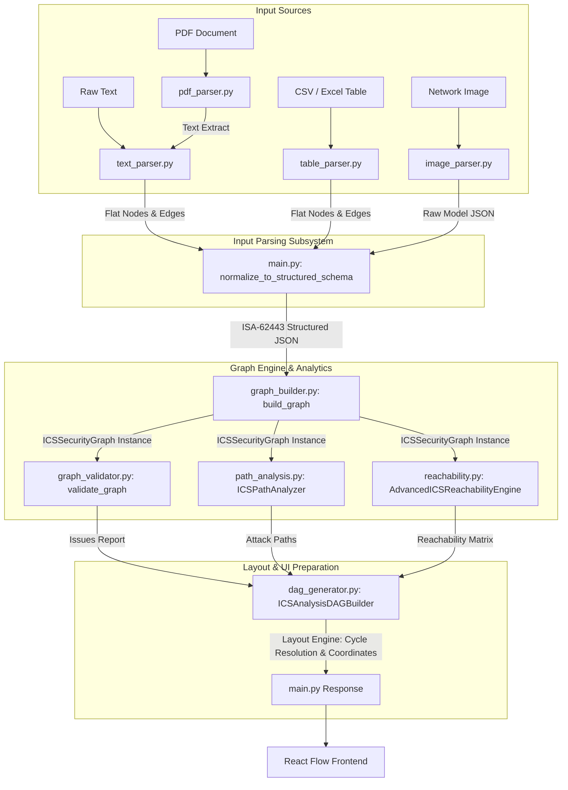

# Architecture Diagram Generator V2 - Backend API & Threat Modeling Engine

Welcome to the backend module of the **Architecture Diagram Generator V2**. This module is a FastAPI-powered threat modeling, risk assessment, and visualization preprocessing engine designed specifically for **Industrial Control Systems (ICS)** and **Operational Technology (OT)** architectures. 

It takes heterogeneous, unstructured sources (raw text descriptions, PDFs, CSV/Excel communication matrices, or network architecture diagrams in image formats) and compiles them into a validated, cyber-physical, dual-layer topological model. It then performs quantitative attack-path analyses, cyber-physical reachability calculations, and generates an optimized, cycle-resolved layout ready for rendering in a React Flow frontend.

---

## Table of Contents
1. [Industrial Control Systems (ICS) Core Concepts](#industrial-control-systems-ics-core-concepts)
   - [The Purdue Model (ISA-95)](#1-the-purdue-model-isa-95)
   - [Zones and Conduits (ISA-62443)](#2-zones-and-conduits-isa-62443)
   - [Trust Boundaries & Enforcement Points](#3-trust-boundaries--enforcement-points)
   - [Cyber-Physical Threat Vectors](#4-cyber-physical-threat-vectors)
2. [System Architecture & Processing Pipeline](#system-architecture--processing-pipeline)
   - [Architectural Data Flow](#architectural-data-flow)
   - [Data Pipeline Overview](#data-pipeline-overview)
3. [File-by-File Codebase Walkthrough](#file-by-file-codebase-walkthrough)
   - [Entrypoint & API Router](#entrypoint--api-router)
   - [Input Parsing Subsystem (`parsers/`)](#input-parsing-subsystem-parsers)
   - [Graph Engine & Analytics Subsystem (`DAG/`)](#graph-engine--analytics-subsystem-dag)
4. [Mathematical Modeling & Security Algorithms](#mathematical-modeling--security-algorithms)
   - [Asset Risk Scoring Formula](#1-asset-risk-scoring-formula)
   - [Attack Path Likelihood & Risk Calculations](#2-attack-path-likelihood--risk-calculations)
   - [Path Confidence Score Propagation](#3-path-confidence-score-propagation)
   - [Semantic Cycle Resolution Algorithm](#4-semantic-cycle-resolution-algorithm)
   - [Dynamic UI Coordinate Generation](#5-dynamic-ui-coordinate-generation)
5. [API Endpoint Reference](#api-endpoint-reference)
6. [Local Setup & Configuration Guide](#local-setup--configuration-guide)

---

## Industrial Control Systems (ICS) Core Concepts

Securing Operational Technology (OT) requires a fundamentally different approach than standard Information Technology (IT) security. While IT prioritizes *Confidentiality* (protecting data from disclosure), OT prioritizes *Availability* and *Safety* (ensuring physical processes operate continuously and safely). 

This backend structures its analyses around industry-standard frameworks that define OT security architectures.

### 1. The Purdue Model (ISA-95)
The **Purdue Model** (or Purdue Enterprise Reference Architecture - PERA) is a hierarchical model that segments systems into distinct layers based on their operational function and timing requirements. 

This engine maps and validates assets against these layers to detect architectural bypasses:

*   **Level 5: Enterprise Network (Corporate WAN / Cloud)**
    *   *Function*: Enterprise resource planning (ERP), email, corporate databases, and business systems. 
    *   *Timing*: Hours to days.
*   **Level 4: Business Logistics Systems (Site Office / IT)**
    *   *Function*: Plant-level production scheduling, IT services, and corporate internet access.
*   **Level 3.5: Industrial DMZ (IDMZ)**
    *   *Function*: A critical security buffer separating the IT corporate network from the OT control network. No direct connections are permitted between Level 4 and Level 3. Only replication servers (e.g., Historian mirrors) live here.
*   **Level 3: Operations Systems (OT Control Room / Site Operations)**
    *   *Function*: Centralized control room servers, SCADA (Supervisory Control and Data Acquisition) hosts, database historians, domain controllers, and engineering workstations.
    *   *Timing*: Seconds to minutes.
*   **Level 2: Local Control (HMIs / Workstations)**
    *   *Function*: Human-Machine Interfaces (HMIs) and local control terminals that allow operators to monitor and manipulate local processes.
    *   *Timing*: Milliseconds to seconds.
*   **Level 1: Basic Control (PLCs / RTUs / Safety Controllers)**
    *   *Function*: Programmable Logic Controllers (PLCs), Remote Terminal Units (RTUs), and dedicated Safety Instrumented Systems (SIS). These devices execute real-time closed-loop control algorithms.
    *   *Timing*: Microseconds to milliseconds.
*   **Level 0: The Physical Process (Sensors / Actuators)**
    *   *Function*: Motors, valves, pumps, temperature transmitters, and physical equipment. This level represents the physics of the operation.

```
       +---------------------------------------------+
       |   Level 5: Enterprise (ERP, Business WAN)    |
       +---------------------------------------------+
                              |
       +---------------------------------------------+
       |   Level 4: Corporate IT (Site Logistics)     |
       +---------------------------------------------+
                              |
     ================== IDMZ (Level 3.5) ==================  <-- Enforcement Point (Firewall)
                              |
       +---------------------------------------------+
       |   Level 3: Operations SCADA / Historians    |
       +---------------------------------------------+
                              |
       +---------------------------------------------+
       |   Level 2: Local Control (HMIs, Operator WS)|
       +---------------------------------------------+
                              |
       +---------------------------------------------+
       |   Level 1: Basic Control (PLCs, RTUs, SIS)  |
       +---------------------------------------------+
                              |
       +---------------------------------------------+
       |   Level 0: Physical Process (Pumps, Valves) |
       +---------------------------------------------+
```

### 2. Zones and Conduits (ISA-62443)
Under the **ISA-62443** international security standard, flat networks are deprecated in favor of **Zones and Conduits**:
*   **Zone**: A grouping of logical or physical assets sharing common security requirements. Assets in a zone must share similar criticality levels and risk tolerances. (e.g., "Turbine Local Control Zone", "Safety Instrumented System Zone").
*   **Conduit**: The only authorized communication path between two zones. All communications crossing a zone boundary must be channeled through a conduit, which subjects the traffic to security controls.

### 3. Trust Boundaries & Enforcement Points
*   **Trust Boundary**: The border between two zones of differing trust levels (e.g., corporate network to operations control).
*   **Enforcement Point**: A physical or logical device (e.g., firewall, industrial data diode, secure VPN gateway) positioned at a trust boundary to monitor, filter, or restrict traffic crossing a conduit.
*   *Validation Check*: The backend checks for **Cross-Zone Leaks**—any communication link that spans two different zones without passing through an explicit enforcement point.

### 4. Cyber-Physical Threat Vectors
In an IT environment, a compromise leads to data loss. In an OT/ICS environment, a compromise of a cyber-asset (e.g., a PLC at Level 1) can propagate to the physical process (e.g., Level 0), resulting in environmental damage, equipment destruction, or loss of life.
*   The engine parses and highlights **Cyber-Physical Edge Dependencies** (e.g., a PLC controlling a generator) to trace how an attacker can navigate from an external network connection down to physical target equipment.

---

## System Architecture & Processing Pipeline

### Architectural Data Flow

The backend handles requests through a structured series of transformations, converting unformatted inputs into structured React Flow graphs:



### Data Pipeline Overview

1.  **Ingestion & Parsing**: An HTTP request carrying file data or raw text arrives at `main.py`. The matching parser in the `parsers/` package extracts the asset descriptions.
2.  **Schema Normalization**: The parser's raw output is passed to `normalize_to_structured_schema()`. This function maps the components to standard ISA-62443 constructs: `zones`, `assets`, `roles`, `communications`, `permissions`, and `physical_dependencies`. It also assigns default Purdue Levels and criticality ratings based on device type keywords.
3.  **Security Graph Construction**: The normalized JSON is sent to `build_graph()`. This initializes an `ICSSecurityGraph` object containing two parallel NetworkX graph topologies:
    *   An **Asset Graph** (`DiGraph`) tracking fine-grained device communications.
    *   A **Zone Graph** (`DiGraph`) modeling macro zone-to-zone conduits.
4.  **Static Quality Auditing**: The `validate_graph()` function checks the graph for structural anomalies (e.g., loops, orphan nodes, Purdue layer bypasses, and un-enforced cross-zone communication links).
5.  **Quantitative Risk Analysis**:
    *   `ICSPathAnalyzer` evaluates all paths from entry points (e.g., VPNs, Operator terminals) to final physical targets. It scores the risk of each path based on its cumulative Impact and Likelihood.
    *   `AdvancedICSReachabilityEngine` maps the macro-level reachability matrix and identifies critical cyber-physical vectors.
6.  **Layout Generation & Cycle Resolution**: The `ICSAnalysisDAGBuilder` takes the security graph and resolves any cycles to prevent layout errors in the frontend. It groups nodes by zone and maps their Purdue levels to vertical tiers (0 to 6). It calculates the dynamic horizontal width of each zone container based on its node density, computes relative `(x, y)` coordinates for the assets, and outputs a UI-ready JSON response.

---

## File-by-File Codebase Walkthrough

### Entrypoint & API Router

#### [main.py](file:///c:/Users/dines/OneDrive/Desktop/ICS/ICS_Architecture/architecture-diagram-generator-v2/backend/main.py)
This is the root FastAPI application. It configures CORS middleware, defines storage paths, registers endpoints, and orchestrates the parsing and analysis workflow.

*   **Core Functions**:
    *   `normalize_to_structured_schema(parse_output)`: Normalizes parser outputs to a standard threat model schema. For nodes, it infers Purdue Levels and Criticality from terms in their labels. For edges, it separates them into human permissions (if the source is a user), cyber-physical dependencies (if the destination is a physical asset or sensor), and communication links.
    *   `run_security_analysis(structured_data, selected_role)`: The primary orchestration function. It builds the graph, runs validation, performs attack-path and reachability analyses, computes layout coordinates, and returns a unified JSON payload.
    *   `process_uploaded_file(file_path, suffix)`: Inspects file extensions and delegates to the appropriate parser module.
*   **API Endpoints**:
    *   `GET /health`: Basic health check.
    *   `POST /generate-from-text` (alias `/generate-text`): Processes raw architectural descriptions.
    *   `POST /upload` (alias `/generate-file`): Processes file uploads (`.txt`, `.pdf`, `.csv`, `.xlsx`, `.png`, `.jpg`, `.jpeg`, `.webp`).

---

### Input Parsing Subsystem (`parsers/`)

This module translates raw, unstructured files and text descriptions into structured lists of nodes and edges.

#### [parsers/text_parser.py](file:///c:/Users/dines/OneDrive/Desktop/ICS/ICS_Architecture/architecture-diagram-generator-v2/backend/parsers/text_parser.py)
Parses plain text using regular expressions to extract node connections and falls back to a hardcoded industrial wind-farm control system (ICS) topology if no connection patterns are found.

*   **Core Functions**:
    *   `clean_name(value)`: Normalizes whitespace and removes newline characters.
    *   `guess_type(label)`: Assigns structural device categories (e.g., `firewall`, `vpn`, `plc`, `server`, `user`, `zone`) using keyword matching.
    *   `build_graph_from_edges(edge_rows)`: Builds list of nodes and edges from raw edge rows, mapping node labels to unique sequential IDs (e.g., `n1`, `n2`).
    *   `text_to_graph(text)`: Scans the text for patterns like `connects to`, `->`, and `→`. If matches are found, it builds the graph from them. If not, it builds a fallback reference model representing a typical wind turbine network topology.

#### [parsers/pdf_parser.py](file:///c:/Users/dines/OneDrive/Desktop/ICS/ICS_Architecture/architecture-diagram-generator-v2/backend/parsers/pdf_parser.py)
Extracts raw text from PDF documents to feed into the text parser.

*   **Core Functions**:
    *   `extract_pdf_text(path)`: Opens a PDF document using PyMuPDF (`fitz`), iterates through its pages, extracts plain text, and returns a single concatenated string.

#### [parsers/table_parser.py](file:///c:/Users/dines/OneDrive/Desktop/ICS/ICS_Architecture/architecture-diagram-generator-v2/backend/parsers/table_parser.py)
Parses CSV and Excel files containing communication matrices (e.g., source-to-destination connection tables).

*   **Core Functions**:
    *   `table_to_graph(path)`: Identifies columns for sources and destinations by searching for headers like `source`, `destination`, `from`, `to`, `src`, or `dst`. It reads the rows into source-destination pairs and extracts connection protocols (e.g., HTTPS, Modbus) if a `protocol`, `type`, or `label` column is present.
    *   *Code Implementation Note*: 
        > [!WARNING]
        > The current codebase calls `build_graph_from_edges(edge_pairs)` on line 53, passing a list of tuples `(source, target)`. However, `build_graph_from_edges` expects a list of dictionaries with `.get()` accessors (e.g., `row.get("source")`). This mismatch will cause an `AttributeError` when processing table files.

#### [parsers/image_parser.py](file:///c:/Users/dines/OneDrive/Desktop/ICS/ICS_Architecture/architecture-diagram-generator-v2/backend/parsers/image_parser.py)
A cognitive parser that processes network architecture screenshots using a vision language model (OpenAI GPT-4.1).

*   **Core Functions**:
    *   `preprocess_image(image_path)`: Resizes images to a maximum width of 1500px using PIL, preserving label readability while reducing API token costs.
    *   `image_to_graph(image_path)`: Encodes the preprocessed image in Base64 and sends it to the OpenAI Chat Completions API. It uses a detailed system prompt to extract a structured threat model JSON representing Purdue levels, asset criticalities, zone boundaries, protocols, and control dependencies.
    *   `transform_to_dag(graph_data)`: Converts the vision model's output into a flat node and edge structure. It maps zones, assets, and roles to nodes, and translates communication links, conduits, permissions, and cyber-physical dependencies into annotated edges.

#### [parsers/ocr_parser.py](file:///c:/Users/dines/OneDrive/Desktop/ICS/ICS_Architecture/architecture-diagram-generator-v2/backend/parsers/ocr_parser.py)
*Status: Legacy / Unused in production.*
An alternative image processing module that uses EasyOCR and OpenCV. It is bypassed in the main pipeline in favor of the direct GPT-4.1 vision-based parser in `image_parser.py`.

*   **Core Functions**:
    *   `preprocess_for_ocr(image_path)`: Converts an image to grayscale, resizes it by 160% to improve readability of small text, and applies binary thresholding.
    *   `extract_ocr_text(image_path)`: Runs the preprocessed image through an EasyOCR reader to extract plain text strings with a confidence score of $\ge 0.25$.

---

### Graph Engine & Analytics Subsystem (`DAG/`)

#### [DAG/models/](file:///c:/Users/dines/OneDrive/Desktop/ICS/ICS_Architecture/architecture-diagram-generator-v2/backend/DAG/models)
Contains simple modeling primitives representing graph elements:
*   [node.py](file:///c:/Users/dines/OneDrive/Desktop/ICS/ICS_Architecture/architecture-diagram-generator-v2/backend/DAG/models/node.py): Defines the `Node` object.
*   [edge.py](file:///c:/Users/dines/OneDrive/Desktop/ICS/ICS_Architecture/architecture-diagram-generator-v2/backend/DAG/models/edge.py): Defines the directed `Edge` object.
*   [graph_model.py](file:///c:/Users/dines/OneDrive/Desktop/ICS/ICS_Architecture/architecture-diagram-generator-v2/backend/DAG/models/graph_model.py): Defines the `Graph` container class.
*   *Implementation Note*: These classes are legacy models. The core security analysis pipeline uses NetworkX (`nx.DiGraph`) instances directly for better performance and algorithm support.

#### [DAG/graph_builder.py](file:///c:/Users/dines/OneDrive/Desktop/ICS/ICS_Architecture/architecture-diagram-generator-v2/backend/DAG/graph_builder.py)
Builds the security graph model from normalized parser outputs. It initializes the `ICSSecurityGraph` container, calculates base risk scores, classifies operational roles, and builds the zone-conduit map.

*   **Core Functions**:
    *   `ICSSecurityGraph.__init__()`: Initializes the parallel `asset_graph` and `zone_graph` structures, index lookup tables, and threat boundary indicators.
    *   `_calculate_risk_score(attributes)`: Computes an initial risk score based on asset criticality, Purdue level, and node category.
    *   `_classify_security_role(node_id, attributes)`: Identifies the asset's security role (e.g., `ENTRY_POINT`, `BOUNDARY_DEVICE`, `PIVOT_POINT`, or `FINAL_TARGET`) based on its type and Purdue level.
    *   `add_node_with_semantics(node_id, attributes)`: Validates node uniqueness, computes risk and role values, and updates query indexes.
    *   `add_edge_with_semantics(edge_id, source, target, attributes)`: Creates missing nodes if referenced in edges, identifies edges that cross zone boundaries, and checks if those links pass through an enforcement point. If not, it logs a cross-zone boundary leak.

#### [DAG/graph_validator.py](file:///c:/Users/dines/OneDrive/Desktop/ICS/ICS_Architecture/architecture-diagram-generator-v2/backend/DAG/graph_validator.py)
An automated auditor that reviews the network topology to verify structural integrity and check compliance with basic ICS security standards.

*   **Core Functions**:
    *   `validate_graph(ics_graph)`: Validates the graph against these security rules:
        1.  *Acyclicity*: Verifies the graph is a Directed Acyclic Graph (DAG) and reports any feedback loop cycles.
        2.  *Connectivity*: Identifies orphan nodes.
        3.  *Threat Boundaries*: Verifies the presence of entry points and critical target assets.
        4.  *Purdue Compliance*: Flags direct communication links that skip Purdue levels (e.g., a direct link between Level 4 and Level 1).
        5.  *Zone Isolation*: Reports any cross-zone links that bypass firewalls or enforcement points.

#### [DAG/layer_assignment.py](file:///c:/Users/dines/OneDrive/Desktop/ICS/ICS_Architecture/architecture-diagram-generator-v2/backend/DAG/layer_assignment.py)
Maps Purdue level strings to vertical tiers for layout rendering.

*   **Core Functions**:
    *   `_parse_purdue_to_tier(purdue_level_str)`: Uses regular expressions to extract numeric levels and maps them to layout tiers (0 through 6). Higher Purdue levels (corporate network) map to top tiers, while lower levels (PLCs and physical processes) map to bottom tiers.

#### [DAG/path_analysis.py](file:///c:/Users/dines/OneDrive/Desktop/ICS/ICS_Architecture/architecture-diagram-generator-v2/backend/DAG/path_analysis.py)
Calculates attack paths and analyzes blast radii. It simulates how an attacker could move through the network from an entry point to compromise critical assets.

*   **Core Functions**:
    *   `ICSPathAnalyzer._evaluate_path(path)`: Calculates overall risk for a path as the product of its cumulative Impact and Likelihood. The likelihood score starts at 100% and decreases as it crosses trust boundaries or encounters firewalls.
    *   `analyze_attack_paths(entry_points, targets, top_n, max_depth)`: Uses Yen's k-shortest paths algorithm (`nx.shortest_simple_paths`) to find the highest-risk paths from entry points to critical targets, using depth limits to control search times.
    *   `analyze_blast_radius(compromised_node_id)`: Calculates the downstream impact of a compromised node by finding all reachable nodes (`nx.descendants`) and grouping them by criticality, zone, and node type.

#### [DAG/reachability.py](file:///c:/Users/dines/OneDrive/Desktop/ICS/ICS_Architecture/architecture-diagram-generator-v2/backend/DAG/reachability.py)
Maps zone-to-zone reachability and validates cyber-to-physical vectors.

*   **Core Functions**:
    *   `_compute_path_confidence(path)`: Propagates confidence values along a path by multiplying edge confidence coefficients and scaling by average node extraction confidence scores.
    *   `check_cyber_to_physical_reachability(entry_points)`: Verifies whether any external or high-level cyber entry point can establish a path to a physical asset at Level 0.
    *   `compute_zone_to_zone_matrix()`: Aggregates individual asset links to build a macro-level ISA-62443 zone-to-zone communication matrix.
    *   `get_prioritized_reachability(source_node, min_confidence)`: Returns all nodes reachable from a starting node, sorted by criticality (e.g., CRITICAL, HIGH, MEDIUM, LOW) and path confidence.

#### [DAG/dag_generator.py](file:///c:/Users/dines/OneDrive/Desktop/ICS/ICS_Architecture/architecture-diagram-generator-v2/backend/DAG/dag_generator.py)
The layout engine. It processes the security graph to resolve cycles and calculate coordinate offsets, generating a JSON structure ready for React Flow.

*   **Core Functions**:
    *   `_score_edge_for_removal(u, v, data)`: Evaluates edges in a cycle to determine which one is safest to remove. It protects critical assets, physical control loops, and active attack paths while prioritizing the removal of low-confidence or cross-zone edges.
    *   `_resolve_cycles_semantically()`: Semantically breaks cycles to ensure the graph is a Directed Acyclic Graph (DAG) for layout purposes. Removed edges are stored as "suppressed edges" and sent to the UI to be rendered as non-directional links.
    *   `_generate_react_flow_payload()`: Computes coordinates for nodes and zones:
        1.  Compresses Purdue levels into consecutive layer indexes to prevent empty vertical space.
        2.  Calculates container widths dynamically based on the maximum number of nodes in any single layer of a zone.
        3.  Positions zone containers side-by-side with padding.
        4.  Sorts nodes within each layer by criticality (Critical $\to$ High $\to$ Medium $\to$ Low) and centers them horizontally within their zone containers.
    *   `build()`: Orchestrates cycle resolution, coordinate calculation, and returns the final React Flow payload alongside macro zone connection data.

---

## Mathematical Modeling & Security Algorithms

### 1. Asset Risk Scoring Formula
The engine calculates risk scores for individual assets based on their criticality, Purdue level, and operational role.

$$\text{Risk Score} = (\text{Base Criticality} + \text{Purdue Level Weight}) \times \text{Category Multiplier}$$

*   **Base Criticality Weight**:
    $$\text{Criticality} = \begin{cases} 40, & \text{if "critical"} \\ 30, & \text{if "high"} \\ 20, & \text{if "medium"} \\ 10, & \text{if "low"} \end{cases}$$
*   **Purdue Level Weight**:
    $$\text{Purdue Level} = \begin{cases} 30, & \text{if Level 0 or Level 1} \\ 20, & \text{if Level 2} \\ 10, & \text{if Level 3} \\ 0, & \text{otherwise} \end{cases}$$
*   **Category Multiplier**:
    $$\text{Multiplier} = 1.0 + \Delta_{\text{physical}} + \Delta_{\text{enforcement}}$$
    *   $\Delta_{\text{physical}} = 0.5$ if the node is a physical asset.
    *   $\Delta_{\text{enforcement}} = 0.2$ if the node is an enforcement point (e.g., firewall).

---

### 2. Attack Path Likelihood & Risk Calculations
The path analyzer computes the risk of an attack path as the product of its cumulative Impact and its Likelihood.

$$\text{Path Risk} = \text{Path Impact} \times \text{Path Likelihood}$$

*   **Path Impact ($I$)**: Calculated by summing weights along the path:
    $$I = \max\left(\sum_{n \in \text{nodes}} I(n), \; 10.0\right)$$
    *   $I(n) = 25.0$ if $n$ is critical.
    *   $I(n) = 50.0$ if $n$ is a physical process.
*   **Path Likelihood ($L$)**: Models the probability of an attacker successfully traversing the path. It starts at $1.0$ and is degraded by security controls and path complexity:
    $$L = L_0 \times (0.95)^k \times \prod_{e \in \text{edges}} C(e) \times \prod_{n \in \text{nodes}} F(n)$$
    *   $L_0 = 1.0$ (Initial probability).
    *   $k = \text{Path Length}$ (number of hops).
    *   $C(e) = 0.9$ if the edge is a credentialed permission (`HUMAN_PERM`).
    *   $C(e) = 0.8$ if the edge is cyber-physical (`CYBER_PHYSICAL`).
    *   $C(e) = 0.7$ if the edge crosses a zone boundary.
    *   $F(n) = 0.4$ if the node is an enforcement point (firewall).

---

### 3. Path Confidence Score Propagation
The reachability engine evaluates the reliability of a discovered path by combining the confidence scores of its nodes and edges.

$$\text{Path Confidence} = \left( \frac{1}{M} \sum_{i=1}^{M} \text{Conf}(n_i) \right) \times \prod_{j=1}^{M-1} \text{Conf}(e_j)$$

*   Where $M$ is the number of nodes in the path.
*   $\text{Conf}(n_i)$ is the extraction confidence of node $i$ (defaults to $1.0$).
*   $\text{Conf}(e_j)$ is the extraction confidence of edge $j$ (defaults to $1.0$).

---

### 4. Semantic Cycle Resolution Algorithm
To ensure the graph can be rendered as a clear hierarchy in the UI, the engine temporarily breaks cycles. It identifies the edge in the loop that has the highest removal score:

$$\text{Edge Removal Score} = W_{\text{confidence}} + W_{\text{type}} + W_{\text{boundary}} - W_{\text{protection}} - W_{\text{attack\_path}}$$

*   **Low-confidence edges** ($Conf < 0.6$): $+100$
*   **Human permissions** (`HUMAN_PERM`): $+80$
*   **Cross-zone boundary crossings**: $+50$
*   **Cyber-Physical controls**: $-500$ (highly protected)
*   **Critical assets**: $-200$ (highly protected)
*   **Level 0 or Level 1 assets**: $-150$ (protected)
*   **Active attack path edge**: $-1000$ (explicitly protected from removal)

The edge with the highest score in the loop is removed and stored as a "suppressed edge".

---

### 5. Dynamic UI Coordinate Generation
To layout the graph, the engine calculates coordinates for each node:

*   **Vertical Position ($Y$)**: Determined by the node's Purdue tier:
    $$Y_{\text{node}} = \text{Tier} \times \text{VERTICAL\_SPACING}$$
*   **Horizontal Position ($X$)**: Centered within its zone container:
    $$X_{\text{node}} = X_{\text{zone\_anchor}} + \text{Padding} + \frac{W_{\text{zone}} - W_{\text{layer}}}{2} + (i \times \text{HORIZONTAL\_SPACING})$$
    *   Where $i$ is the node's sorted index within its layer.
    *   $W_{\text{layer}} = (\text{number of nodes in layer}) \times \text{HORIZONTAL\_SPACING}$.
    *   $W_{\text{zone}} = \max\left(\text{MIN\_WIDTH}, \; \text{MaxNodesInZoneLayer} \times \text{HORIZONTAL\_SPACING} + 2 \times \text{Padding}\right)$.

---

## API Endpoint Reference

| Endpoint | Method | Input Payload | Output Structure | Description |
| :--- | :--- | :--- | :--- | :--- |
| `/` | `GET` | None | `{"status": "Backend running"}` | Root health and status check. |
| `/health` | `GET` | None | `{"status": "ok"}` | Basic uptime check. |
| `/generate-from-text` | `POST` | `{"text": "string", "role": "string"}` | Threat Model Analysis JSON | Parses architectural text, runs security analysis, and returns coordinates. |
| `/generate-text` | `POST` | `{"text": "string", "role": "string"}` | Threat Model Analysis JSON | Alias for `/generate-from-text`. |
| `/upload` | `POST` | Multipart Form Data: `file`, Query parameter: `role` | Threat Model Analysis JSON | Accepts architecture files (`.txt`, `.pdf`, `.csv`, `.xlsx`, `.png`, `.jpg`, `.jpeg`, `.webp`), parses them, and runs security analysis. |
| `/generate-file` | `POST` | Multipart Form Data: `file`, Query parameter: `role` | Threat Model Analysis JSON | Alias for `/upload`. |

### Standard Response Structure (Threat Model Analysis JSON)
The JSON payload returned by the analysis endpoints contains the following structure:
```json
{
  "react_flow_asset_view": {
    "nodes": [
      {
        "id": "node_id",
        "type": "icsNode",
        "parentNode": "group_zone_id",
        "extent": "parent",
        "position": { "x": 120, "y": 160 },
        "data": {
          "id": "node_id",
          "label": "Display Name",
          "type": "plc",
          "node_category": "CYBER_ASSET",
          "zone": "zone_id",
          "criticality": "critical",
          "purdue_level": "Level 1",
          "is_enforcement_point": false,
          "risk_score": 70.0,
          "security_role": "FINAL_TARGET",
          "in_attack_path": true
        }
      }
    ],
    "edges": [
      {
        "id": "edge_id",
        "source": "source_id",
        "target": "target_id",
        "type": "smoothstep",
        "animated": true,
        "data": {
          "label": "Modbus",
          "edge_type": "COMM_LINK",
          "is_boundary_crossing": false,
          "in_attack_path": true
        }
      }
    ],
    "suppressed_edges": []
  },
  "react_flow_macro_zone_view": {
    "nodes": [
      { "id": "macro_zone_id", "data": { "label": "Zone Name" } }
    ],
    "edges": [
      { "id": "macro_e_id", "source": "macro_source", "target": "macro_target", "animated": true }
    ]
  },
  "layout_metadata": {
    "max_depth": 6,
    "zones_rendered": ["zone_id_1", "zone_id_2"],
    "purdue_levels_present": ["Level 0", "Level 1", "Level 2"],
    "critical_assets_count": 1,
    "physical_assets_count": 1
  },
  "validation_report": {
    "is_valid": true,
    "errors": [],
    "warnings": ["Purdue violation: Direct connection skips layers between n1 (L4) and n2 (L1)."],
    "stats": { "total_nodes": 12, "total_edges": 14 }
  },
  "attack_paths": [
    {
      "path": ["n1", "n2"],
      "length": 1,
      "critical_assets": ["n2"],
      "boundaries_crossed": 1,
      "enforcement_points": 0,
      "reaches_physics": true,
      "purdue_trajectory": ["L4.0", "L1.0"],
      "impact_score": 75.0,
      "likelihood_score": 0.63,
      "overall_risk": 47.25,
      "is_realistic": false,
      "realism_warnings": ["Suspicious Architecture Bypass: L4.0 directly to L1.0 (n1 ➔ n2)"],
      "narrative": "[n1 (Entry)] ➔ [n2 (Target)]\n\nSummary: Path crosses 1 trust boundaries..."
    }
  ],
  "reachability_data": {
    "cyber_physical_vectors": [
      {
        "source": "n1",
        "target": "phys_target",
        "path_length": 2,
        "confidence": 0.8,
        "explanation": {
          "summary": "Traverses layers Level 4, Level 1, Level 0 across 1 trust boundaries.",
          "boundaries_crossed_count": 1,
          "enforcement_points_encountered": 0,
          "purdue_levels_traversed": ["Level 0", "Level 1", "Level 4"]
        }
      }
    ],
    "zone_matrix": {
      "enterprise_zone": ["control_zone"]
    }
  },
  "raw_model_data": {}
}
```

---

## Local Setup & Configuration Guide

### Prerequisites
*   Python 3.10+
*   An OpenAI API Key (required for vision-based image parsing)

### Installation Steps
1.  Navigate to the backend directory:
    ```bash
    cd backend
    ```
2.  Create and activate a virtual environment:
    ```bash
    python -m venv venv
    
    # On Windows (Command Prompt)
    venv\Scripts\activate.bat
    
    # On Windows (PowerShell)
    .\venv\Scripts\activate.ps1
    
    # On macOS/Linux
    source venv/bin/activate
    ```
3.  Install the dependencies:
    ```bash
    pip install -r requirements.txt
    ```
4.  Configure your environment variables. Create a [.env](file:///c:/Users/dines/OneDrive/Desktop/ICS/ICS_Architecture/architecture-diagram-generator-v2/backend/.env) file in the `backend` folder:
    ```env
    OPENAI_API_KEY=your-openai-api-key-here
    OPENAI_VISION_MODEL=gpt-4.1
    ```
5.  Start the FastAPI development server:
    ```bash
    uvicorn main:app --reload --port 8000
    ```
    The API documentation will be available at `http://127.0.0.1:8000/docs`.
